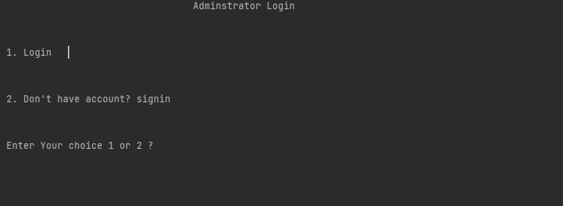
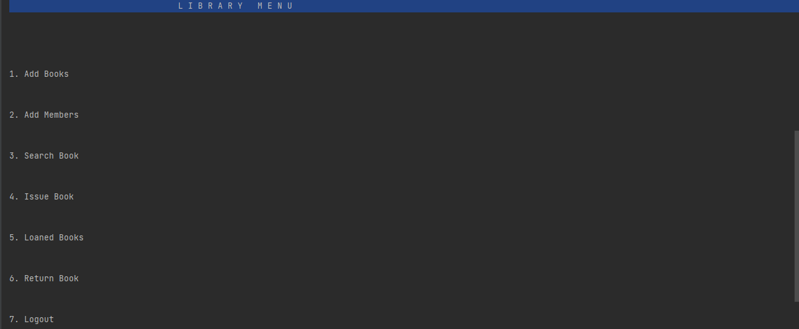

# Library-Book-Loan-System (Python)

The project “Library-Book-Loan-System” is developed in Python and Sqlite, which mainly focuses on basic operations in a library like adding new books, updating loan status, searching books  and return books. In this project we can maintain the late fine of members who returns the issued books after the due date.

## Functions

 - Administrator Login
 - Administrator Signin
 - Add Books
 - Update Loan Status
 - Add Members
 - Search Books
 - Loan Books
 - Return Books

  
## Requirements

- Python
- Sqlite

  
## Installations

Install python to your system

- https://www.python.org/

  
## Steps to use

Just open the folder location in your command prompt and type
    
- python Coursework.py

(or)

 Open in pycharm and run Coursework.py

## Screenshots
- Administrator/operator page
    
  
- Library Menu
    
  